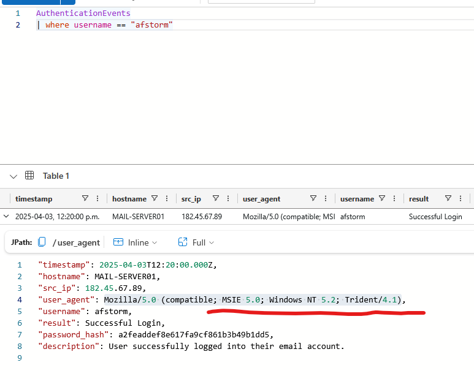

## CloutHaus: Social Media leads to Compromise

### Initial Notes for investigation

#### Instagram and Email Issue

- she has her personal email <b>afomiya.storm@gmail.com</b>, in her Instagram bio. Attackers can use this email to send her phishing attempts along side impersonation. Especially since she does a ton of brand deals, an attackers email can be easily mixed in the bunch. Some things to look for whether it is a phishing attempt are: 

    - Any phrases containing or similar to "requires immediate action", "within 24 hrs". Anything with urgent requests. 
    - The email asks for sensitive information such as SIN, DOB, passwords etc.. 
    - The senders domain does not look legitimate. 
    - Generic greetings such as "Dear customer"

- She posts Q&A stories that allow attackers to send her personal questions such as "Where do you live?", "What your pets name?", "What is your mothers name?". This can be used by attackers when trying to reset an email for example, in which it may require security questions in regards to those answers. 

#### General information

- afomiya clout hause email: afomiya_storm@clouthaus.com 
- MFA: disabled 
- Suspicious URL sent to her: https://super-brand-offer.com/login

    - She clicked on this at 2025-04-03T11:20:00.000Z and submitted her password at 2025-04-03T11:20:02.000Z

- Suspicious URL & IP associated: super-brand-offer.com = 198.51.100.12
    - There are 3 domains associated with this IP address including super-brand-offer.com, diors-partners.com, influencer-deals.net. This may be a <b>hacker hangout</b> where multiple shady domains resolve with that IP address.

- She lives at "The Apartments at CityCenter" due to her posting the apartment on social media. An attacker used a reverse image search engine to figure it out.

### Real Threat 
someone logged into her account.

- The IP address use to gain access was 182.45.67.89 and the domains associated with it are influence-deals.net and diors.partners.com. 
- The host name associated with ip is: MAIL-SERVER01

#### What is a User Agent? 
They are strings that a client (usually a web browser or app) that sends to a server to identify <b>what it is</b>. 

User Agent: Mozilla/5.0 (compatible; MSIE 5.0; Windows NT 5.2; Trident/4.1)

Here Mozilla/5.0 is alright because almost all browsers use it for compatibility reasons. compatible; MSIE 5.0 claims to be Internet Explorer 5.0, Windows NT 5.2 corresponds to Windows Server 2003 / Windows XP x64 era and Trident/4.1 which is the rendering engine used by Internet Explorer. 

This User Agent is extremely old which is rare in modern environments. This is very suspicious. The attacker used "afstorm" which is actually Afomiya's username and logged in successfully. 
 

