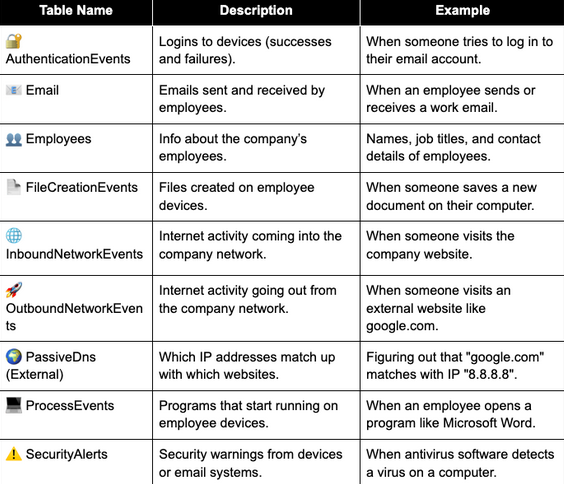

## Common Queries 

```kql
PassiveDns

| where url contains "https://..xyz.com"

| where domain contains "xyz.com"
| distinct ip // gets ip address related to domain 

| where ip contains "123"
```

```kql
AuthenticationEvents 

| where username == "xyz"
```

```kql
InboundNetworkEvents //any requests coming into network

| where src_ip == "x.x.x.x"

| where user_agent == "Mozilla 5.0...xyz"
```

```kql
OutboundNetworkEvents // any requests going outside of network (e.g, websites an employee visits)

| where src_ip == "10.10.0.22"

```

```kql
Email
| where sender =~ "afomiya_storm@clouthaus.com"
| where recipient !endswith "@clouthaus.com"
| summarize count() by recipient
| order by count_ desc // this gets how many times the recipient receives emails
```

```kql
Employees
| take 10 // this returns 10 random tables in the Employees table

| count //counts employees or rows in table

| where role == "xyz" //returns specific employee

| where role contains "xyz" //if you only specific word like instead of "security analyst", you could write "security" and find that role
```
<hr>

The `let` statement is quite powerful to use in KQL. Imagine you want to find all the URLs with the first name "William" visited. There could be many and so doing it one by one is possible, however, that would take too long. This statement lets you <b>name the result of a subquery</b>, where you can use it in other queries. For example, 

```kql
let wills_ips = 
Employees 
| where name has "William"
| distinct ip_addr; 
OutboundNetworkEvents
| where src_ip in (wills_ips)
| distinct url
```

### `has` vs. `contains`

<b>contains</b>

- This will match the string specified anywhere in the text, and is usually meant for paths, URLs, command lines, and long strings. For example, `name contains "William"` will match <b>Williamsngh, "C:\Users\Ryan\Williamson</b>. 


<b>has</b>

- This is similar, but is more of an exact match. KQL will return a string value that matches whatever queried from a string. For example, `"William-Liu"` <b>has</b> `William`, `"powershell.exe - file.ps1"` <b>has</b> `powershell.exe`. 
<hr>

