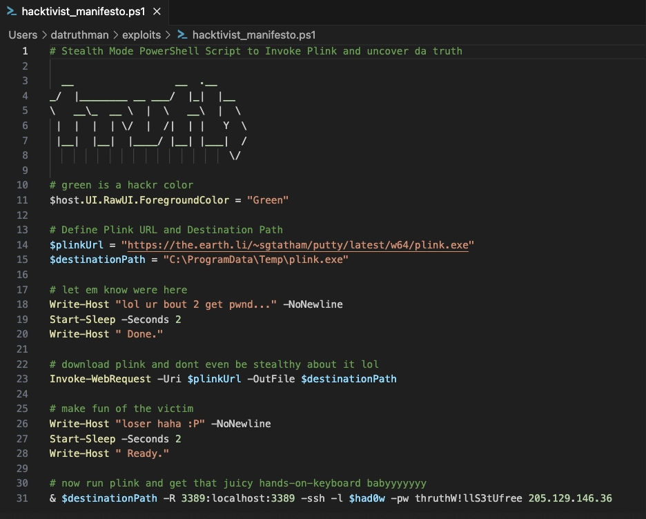

## A Scandal in Valdoria: A Political Mystery 

Nene Leaks was an editor of the Valdoria Times. They posted an article accusing a person called Luffy of land deal scandals, accepting bribes and more, exploiting his position to benefit real estate moguls

The Valdoria Times has hired us to get to the bottom of who did this since they were not apart of it. 


#### General Notes 

- Nene Leaks is the Editorial Director, his email is: nene_leaks@valdoriantimes.news

- Clark Kent is the Newspaper Printer's name so he just prints out the newspapers that are sent to him via email. His ip is : 10.10.0.25. His email is clark_kent@valdoriantimes.news

- Ronnie Mclovin - Editorial Intern hired on 2024-01-02T08:00:00.000Z. Her ip is: 10.10.0.19. His email is: ronnie_mclovin@valdoriantimes.news. Hostname: A37A-DESKTOP
- Sonia Gose - role: Senior Editor. ip: 10.10.0.3. email: sonia_gose@valdoriantimes.news. Hostname: UL0M-MACHINE


#### Suspicious  

- Ronnie sent an email on Jan 31st, 2024 with the subject line URGENT: Final OpEd Draft Edits (Please publish the following article in tomorrow's paper). There was also a link attached: https://sharepoint.valdoriantimes.news/files/rmclovin/2024/OpEdFinal_to_print.docx. She claims she did not send this. 

- Sonia Gose recieved a suspicous email from newspaper_jobs@gmail.com about recruitment for a new role. It contained possibly a suspcious link. She clicked the link, we found this with: 

    ```kql
    OutboundNetworkEvents
    | where src_ip == "10.10.0.3"
    | where url == "https://promotionrecruit.com/published/Valdorian_Times_Editorial_Offer_Letter.docx"
    ```

    To see if she downloaded the file, we can use : 

    ```kql
    FileCreationEvents
    | where hostname == "UL0M-MACHINE"
    | where filename == "Valdorian_Times_Editorial_Offer_Letter.docx"
    ```

    Based on the path `C:\Users\sogose\Downloads\Valdorian_Times_Editorial_Offer_Letter.docx`, she did download the file. The sha256 hash on the file she downloaded is `60b854332e393a6a2f0015383969c3ac705126a6b7829b762057a3994967a61f`. This hash is important because even if the filename or path changes, the hash is the same unless the attacker changes the content inside the file. This will be important if anyone else has downloaded the file across the network. 

    After this download, it began executing malicious content where the file ` hacktivist_manifesto.ps1` was written to the disk right way. It was created on 2024-01-05T10:24:32.000Z

    


- we can use go into <b>ProcessEvents</b> to see if there are any related processes to this powershell script. We must use `has` because this will look for this execution anywhere in the string such as `abc123` contains `c12`. 
    ```
    ProcessEvents
    | where hostname == "UL0M-MACHINE"
    | where process_commandline has @"C:\ProgramData\hacktivist_manifesto.ps1"
    ```    

#### Navigation 

- we can use the following to figure out the different discovery command lines the attacker is using on her machine. These can include `ipconfig`, `whoami`, `arp -a`, `tasklist/svc`, `netview`, etc.. Also, usually the <b>process name</b> is `cmd.exe` or `powershell.exe`
    ```kql
    ProcessEvents
    | where hostname == "UL0M-MACHINE"
    | summarize count() by process_name, process_commandline
    ```