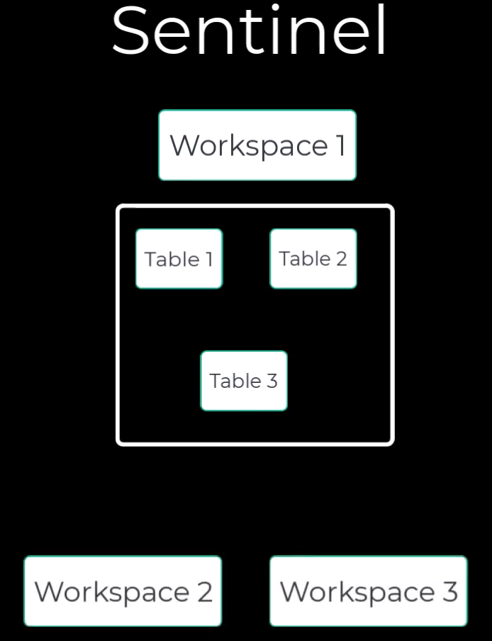
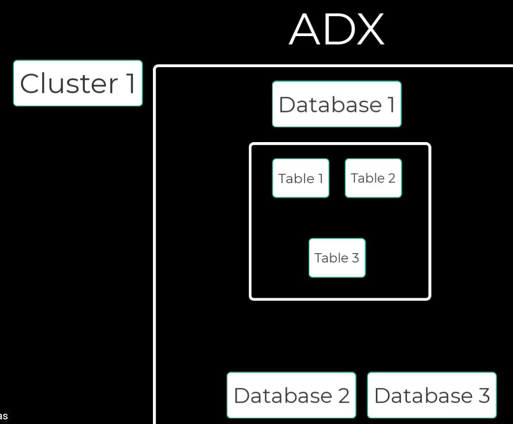

### Sentinel

This is a platform in Microsoft Azure that sits on top of an <b>LAW (Log Analytics Workspace)</b>. This workspace stores logs where it can be queried with <b>KQL</b>. Sentinel is a SIEM meant to aid in security analytics, investigations, incidents, and overall security work. 

- Many tables can be queries from a single LAW. In the case of multiple cloud tenants, multiple workspaces can be queried using the <b>lighthouse feature</b>. 

### ADX

Azure Data Explorer (ADX), also called <b>Kusto</b>, is a high-performance analytics database for ingesting and querying <b>large volumes of time-series/log/telemetry data</b> (e.g., app logs, IoT signals, metrics) using <b>KQL</b>.

- A collection of rows and columns of data is a table. A collection of common tables is a database. A collection of like databases are contained in a cluster. 

## What are Logs? 

Logs are digital receipts of everything that happens on a system. This includes every click, login, file access, network connections and more. They are basically security cameras your for IT environment, in in text form. Without them, you are blind to what goes on in your environment. 

### Three questions they answer: 

1. WHAT happened? 
2. WHEN did it happen? 
3. WHO/WHAT caused it? 

Without logs, an investigation is almost impossible. Not only that, but logs have compliance requirements such as HIPAA, PCI, SOC2 that mandate log retention. 

### How are the stored? 

As mentioned, logs are stored in <b> LAW (Log Analytics Workspace)</b> but they could also be stored in ADX. However, LAW is the default log storage for Azure monitoring + security connectors. This means that mainly all logs are stored in LAW, and you can use Sentinel to query it. 

### Common Tables to Know: 

- `DeviceLogonEvents` → Login/Authentication Activity

    - <b>HUNT</b> for brute force patterns, logons from unusual accounts, 
    admin logons on many machines, etc... 

- `DeviceProcessEvents` → Process Execution (captures process starting/stopping + parent/child relationships)

    - <b>HUNT</b> for suspicious LOLbins. This is called "living off the land binaries" which are pre-installed system tools within an operating system often digitally signed. Moreover, you'd hunt for weird parent/child chains (Word → PowerShell), and unusual command line executions.

- `DeviceNetworkEvents`→ Captures outbound/inbound network connections tied to a device and often a process. 

    - <b>HUNT</b> for C2/beaconing (repeated connections to same IP/domain), connections to suspicious countries, ports or rare domains, and detect for lateral movement. 

- `DeviceFileEvents` → It captures file operations such as create, modify, delete, and rename activity. 

    - <b>HUNT</b> for ransomware behaviour (mass file renames/encryption), dropped payloads in temp/user dirs, and suspicious writes to startup folders. 

- `SecurityAlert` → Captures alert records when a detection is fired. You would use this when starting an investigation, view evidence, and correlate alerts across Microsoft security products such as Defender for Endpoint (MDE), Defender for Office 365, etc... 

- `SigninLogs` → Captures Azure AD authentication, so cloud sign-ins to Microsoft. 

    - <b>HUNT</b> for impossible travel sign-ins, MFA challenges (Bypass, fails), legacy authentication (checks if user is using modern authentication method or old one since backwards compatibility exists and older technology is still used in companies). 